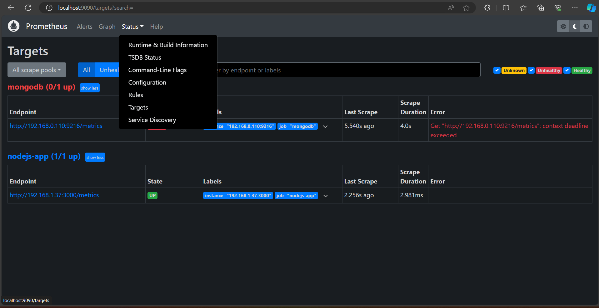

# Grafana-and-Prometheus
## Setting Up Premetheus

1. **[Code changes for Log generation](#web-application-deployment)**
    - clone travel memory repo and  use command for install package prom-client
      ```
        npm i prom-client
      ```
    - make code change in [index.js](index.js) of backend.
    - Run FrontEnd and BackEnd services

3. **[Premetheus On docker](#load-balancing-with-elb)**
    - Code snippet for Load Premetheus configuartion: [prometheus-config.yml](prometheus-config.yml)
    - Docker Compose file for Premetheus On docker: [docker-compose.yaml](docker-compose.yaml)
    - Use following command to run Premetheus Docker Container
      ```
        docker run --name my-prometheus --mount type=bind,source="$(pwd)"/prometheus-config.yml,destination=/etc/prometheus/prometheus.yml -p 9090:9090  prom/prometheus

      ```

4. **[Premetheus Running status and Target](#auto-scaling-group-asg-configuration)**
    - open localhost:9090
    - If you are able see this page that means Premetheus Docker Container running
      
    - Nevigate Target if you are able to target that means target pointed out correctly 
        
5. **[Lambda-based Health Checks & Management](#lambda-based-health-checks--management)**
    - Developing a Lambda function for health checks
    - Handling failing instances and notifications through SNS
    - Screenshots related to the code

6. **[S3 Logging & Monitoring](#s3-logging--monitoring)**
    - Content related to S3 Logging and monitoring (not provided in the given information)


    
### Web Application Deployment

During this phase, specific tasks are executed elegantly:
- Using `boto3`, I launched two EC2 instances (Frontend and Backend), configuring them as Nginx web servers. Subsequently, I deployed the web application onto these EC2 instances.
The code sequence involves instance launching, downloading Git dependencies, cloning files from the [repository](https://github.com/UnpredictablePrashant/TravelMemory.git)", navigating to TravelMemory, installing NodeJS and NPM, setting up reverse proxy, and executing the application on port 80.
Kindly refer to the codes for launching instances:

    1. [boto3S3LaunchFE.py](https://github.com/sayanalokesh/DynamicWebApplication/blob/main/boto3S3LaunchFE.py)
    2. [boto3S3LaunchBE.py](https://github.com/sayanalokesh/DynamicWebApplication/blob/main/boto3InstanceBE.py)

Enclosed are the relevant screenshots related to the code.


2 Instances have been created using the code.


The code worked fine and successfully launched the application.

### Load Balancing with ELB

Within this phase, utilizing `boto3`, I facilitated the deployment of an Application Load Balancer (ALB) and the registration of EC2 instances with the ALB.
The primary objective of this code is to construct a Load Balancer and associate EC2 instances with the Target Group, set up a listener for the ALB on port 80, and trigger another Python script (`asgConfiguration.py`) for autoscaling configuration.

Refer to the [LoadBalancing.py](https://github.com/sayanalokesh/DynamicWebApplication/blob/main/LoadBalancing.py) for the boto3 code snippet.

Enclosed are the relevant screenshots linked to the code.
Load Balancer:


Target Groups


### Auto Scaling Group (ASG) Configuration

In this phase, the code utilizes the Boto3 library to perform various tasks on AWS services. It identifies an EC2 instance named 'ajay-lokeshFE', creates an Amazon Machine Image (AMI) from it, extracts its configuration details, creates a Launch Template, and establishes an Auto Scaling Group (ASG) with scaling policies based on CPU utilization. Additionally, it assigns a Target Group and sets upscaling policies for the Auto Scaling Group to adjust capacity based on the average CPU utilization.
Refer to the [asgConfiguration.py](https://github.com/sayanalokesh/DynamicWebApplication/blob/main/asgConfiguration.py) for the boto3 code snippet.

Enclosed are the relevant screenshots tied to the code.

Launch Template with the same configuration as Frontend Instance.


AMI


Auto Scaling Group


Instance with the desired number


### Lambda-based Health Checks & Management

Within this phase, I crafted a Lambda function to routinely examine the health status of the web application/Instances (Frontend) via the ALB. Should the health check consistently fail, the Lambda function captures a snapshot of the failing instance for debugging purposes. It then terminates the problematic instance, allowing the ASG to replace it. Additionally, the code sends a notification through SNS to administrators. The EventBridge will check every 10 minutes.

Refer to the [Boto3ForLambdaUnhealthy.py](https://github.com/sayanalokesh/DynamicWebApplication/blob/main/Boto3ForLambdaUnhealthy.py) for the boto3 code snippet.

Enclosed are the  screenshots related to the code.

A function has been created


Code Source has been attached using the same code


CloudWatch Logs


The below screenshot shows the snapshots of unhealthy Instances for debugging purposes.


The instance is getting terminated after invoking the lambda code.


The below screenshot shows the unhealthy state of an Instance via email.


The below screenshot shows the healthy state of an Instance via email.


### S3 Logging & Monitoring

The content for S3 Logging & Monitoring is currently not provided.
